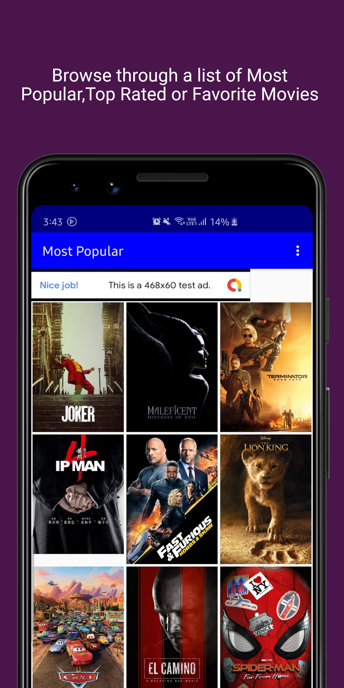
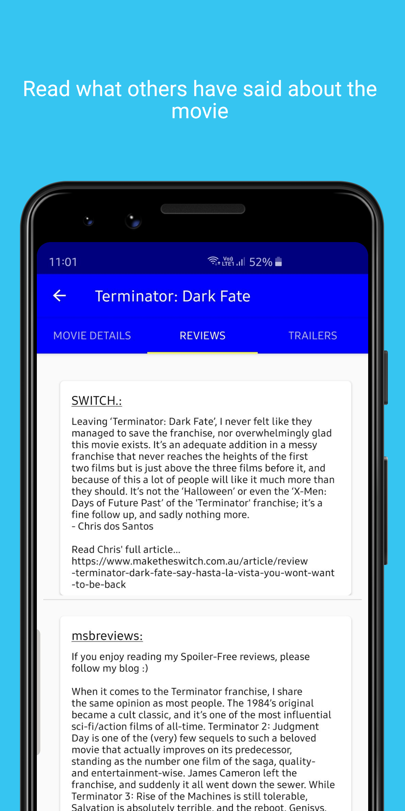
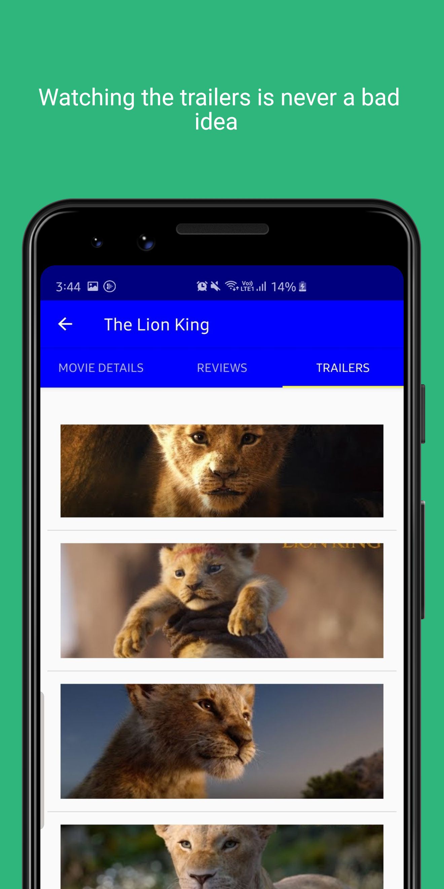
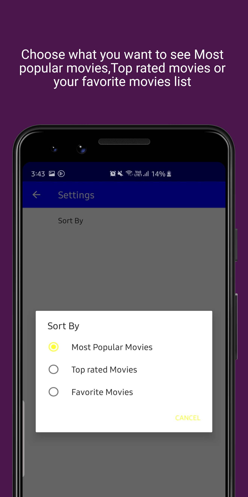
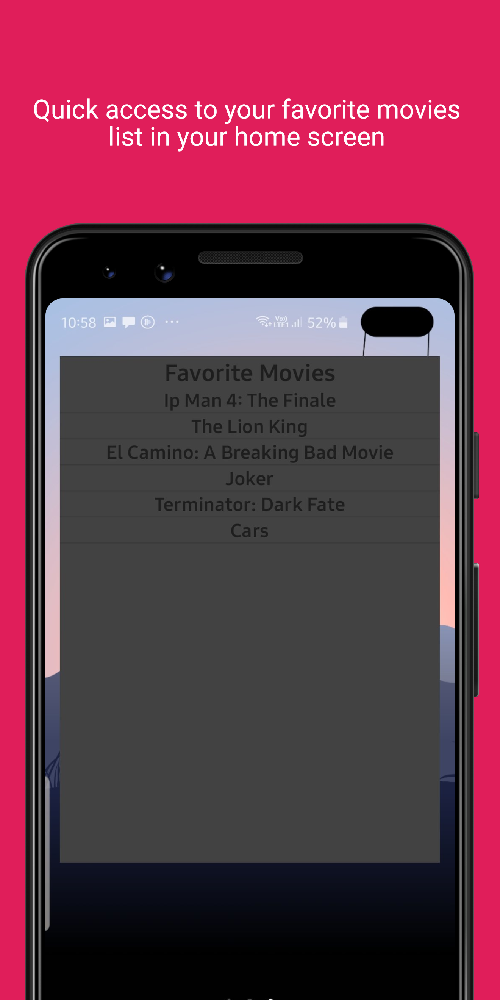

<H3>Movies-Application</H3>

  

  
  

  
  
  

  
    

  
    

  
    

  
 
 

  
  
  

  
  
 

 
<h4> How to Work with the Source </h4>

This app uses The Movie Database API to retrieve movies. 
<a href="https://www.themoviedb.org/">Sign up </a> to get your own API key and then add it in gradle.properties file in order to build the app.
